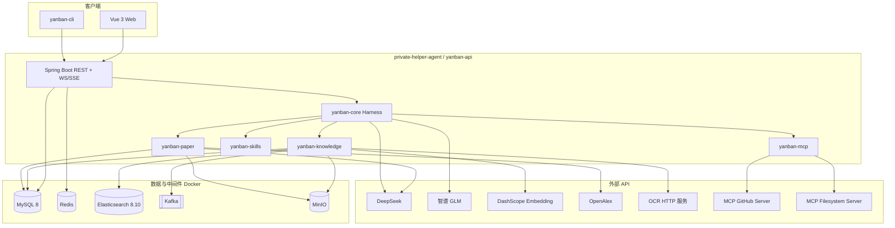

# 研伴 Agent（Yanban Agent）— 技术栈说明

> 文档作用概述：记录**长期有效的技术选型、环境基线、基础设施与版本组合**。当语言、框架、中间件、部署基线发生变化时更新本文件；不要在这里记录阶段进度。
>
> **文档版本**：v1.0  
> **更新日期**：2026-05-24  
> **文档目录**：`memory-bank/`  
> **仓库根目录**：`private_helper_Agent/`  
> **关联文档**：[`design-doucment.md`](./design-doucment.md)、[`implementation.md`](./implementation.md)  
> **新代码目录**：`private-helper-agent/`（仓库根下，与 `memory-bank/` 平级；开发时创建）

本文档根据产品设计 v0.2 与遗留项目（PaiSmart、paper-agent）实践，给出**两阶段实施**下最合适、可落地的技术选型。版本号以**第一期稳定组合**为准，升级需同步回归 KB 索引与论文流水线。

---

## 1. 选型原则

| 原则 | 说明 |
|------|------|
| 与遗留对齐 | KB 侧优先沿用 PaiSmart 已验证组件（Tika、ES、Kafka、DashScope）；论文侧沿用 POI + Orchestrator 模式 |
| 统一存储 | **仅 MySQL** 承载用户、会话、KB 元数据、论文任务；不用 SQLite |
| 新写核心 | Harness、MCP Client、Skills、Provider 抽象均为新实现，不 HTTP 套壳旧服务 |
| 阶段交付 | **阶段 A** 先闭环「登录 + Harness 流式对话 + 默认 RAG + 设置」；**阶段 B** 补齐论文全链路、双 MCP、GLM、KB 全页与 CLI |
| 开源友好 | 依赖许可证清晰；密钥仅环境变量 / 用户配置，不进仓库 |
| 本地 → 服务器 | 第一期 Docker 本地；技术栈支持后期 Linux 服务器部署（无桌面绑定组件） |

---

## 2. 两阶段与技术范围对照

### 阶段 A（约 3–4 天）— 主链路闭环

| 领域 | 纳入技术 | 说明 |
|------|----------|------|
| 运行时 | JDK 17、Spring Boot 3.4.x | 统一父 POM |
| 数据 | MySQL 8、Redis | 用户/JWT、会话、设置；暂可 mock 部分 KB 索引 |
| 认证 | Spring Security + JWT | 注册/登录/刷新 |
| Agent | `yanban-core` Harness、Function Calling | max_steps 默认 20，可配置 |
| 模型 | **DeepSeek**（OpenAI 兼容 HTTP） | WebFlux 流式 |
| 对话 | WebSocket **或** SSE 流式 | 二选一实现，推荐 **WebSocket**（与 PaiSmart 一致） |
| RAG | `search_knowledge` 工具 + 默认开启 | KB 索引可 **简化**：先同步解析小文件或单线程异步，Kafka/ES 在 A 末接通 |
| 前端 | Vue 3 + Vite + Pinia | `/login`、`/chat`、`/settings` |
| 配置 | 共用 `application.yml` + DB `user_settings` | CLI 调用同一后端 API |
| 测试 | JUnit 5 + Mockito | Harness 循环、RAG 开关、JWT 过滤器 |

**阶段 A 刻意延后**：GLM、GitHub MCP、filesystem MCP、code-review Skill、论文三步页、分片上传、检索调试页。

### 阶段 B（约 3–4 天）— 功能齐套

| 领域 | 纳入技术 | 说明 |
|------|----------|------|
| 基础设施 | Kafka、Elasticsearch 8.10、MinIO | Docker Compose 与 PaiSmart 对齐 |
| 知识库 | Tika、HanLP、DashScope Embedding、ES 混合检索 | 分片上传、异步「处理中」、公开/私有 |
| OCR | **可插拔 `OcrProvider`** | 第一期实现 1 个外部 HTTP OCR（如百度/腾讯/本地 Paddle 网关），接口抽象便于替换 |
| 论文 | Apache POI 5.3、OpenAlex HTTP、MinIO + 本地 fallback | 完整 Orchestrator + SSE |
| MCP | stdio Client → **GitHub** + **filesystem** | Node/npx 启动官方或社区 Server；PAT 配置 |
| Skills | 目录加载 `SKILL.md` + yaml | builtin `code-review`（绑定 filesystem tools） |
| 模型 | **智谱 GLM**（OpenAI 兼容适配） | 设置页切换 Provider |
| 前端 | 补全 `/knowledge-base`、`/knowledge-base/search-debug`、`/paper` | 论文三步 + SSE 进度 |
| CLI | Picocli 或 Spring Shell | `login`、`chat`、`kb`、`paper`、`config` |
| 测试 | + 集成测试（Testcontainers 可选） | KB 解析、Skill 加载、MCP mock |

---

## 3. 总览架构图



---

## 4. 后端技术栈

### 4.1 语言与构建

| 技术 | 版本 | 用途 |
|------|------|------|
| Java | **17**（LTS） | 与遗留项目一致 |
| Maven | 3.9+ | 多模块父 POM `com.yanban:yanban-parent` |
| Lombok | 1.18.30+ | 实体与 DTO |
| MapStruct（可选） | 1.5+ | DTO 映射，减轻手写 |

### 4.2 Spring 生态

| 技术 | 版本 | 用途 |
|------|------|------|
| Spring Boot | **3.4.2** | 对齐 PaiSmart；统一依赖管理 |
| Spring Web MVC | 3.4.x | REST、文件上传、SSE |
| Spring WebFlux | 3.4.x | 调用 DeepSeek/GLM **流式** API |
| Spring WebSocket | 3.4.x | Harness 对话流式推送（**推荐主通道**） |
| Spring Security | 3.4.x | JWT 无状态认证 |
| Spring Data JPA | 3.4.x | MySQL 持久化 |
| Spring Data Redis | 3.4.x | Token 黑名单/缓存、上传状态（可选） |
| Spring Kafka | 3.4.x | 文件处理异步（阶段 B） |
| Spring Validation | 3.4.x | 请求校验 |

**模块划分**（Maven）：

| 模块 | 技术职责 |
|------|----------|
| `yanban-core` | Harness、ToolRegistry、Session/Message、ModelProvider 接口 |
| `yanban-knowledge` | 上传、解析、向量化、检索、文档权限 |
| `yanban-paper` | docx、Orchestrator、任务、SSE 事件 |
| `yanban-mcp` | MCP JSON-RPC Client（stdio 进程管理） |
| `yanban-skills` | SKILL.md / skill.yaml 扫描与注入 |
| `yanban-api` | 启动模块、Security、Controller、WS 配置 |
| `yanban-cli` | 命令行（调用 api 或 embedded test profile） |

### 4.3 数据与中间件

| 技术 | 版本 | 用途 |
|------|------|------|
| MySQL | **8.0**（Docker `mysql:8`） | 用户、JWT 关联、agent 会话、KB 元数据、论文 task、settings |
| Redis | **7**（Docker `redis`） | 刷新 Token、上传进度、热点缓存 |
| Elasticsearch | **8.10.4** | 向量 + 全文混合检索（对齐 PaiSmart） |
| Kafka | **Bitnami Kafka**（latest 单节点） | Topic：`file-processing`（可扩展 `vectorization`） |
| MinIO | **RELEASE.2025-04-22** 或兼容版 | 分片对象、论文 docx |
| Flyway 或 Liquibase（推荐） | — | 版本化 DDL；**避免** 生产依赖 JPA `ddl-auto: update` |

**MySQL 逻辑库**：单库 `yanban_agent`（名称可配置），表前缀建议：`sys_`、`agent_`、`kb_`、`paper_`。

### 4.4 文档、检索与论文

| 技术 | 版本 | 用途 |
|------|------|------|
| Apache Tika | **2.9.1** | PDF / Word / Markdown 文本提取 |
| HanLP | **portable-1.8.6** | 中文分词（混合检索文本侧） |
| Apache POI | **5.3.0** | 论文 docx 读写（对齐 paper-agent） |
| Apache Commons Codec | 1.16+ | 分片 MD5 |
| Commons IO | 2.14+ | 流式 IO |
| OpenAlex API | HTTPS | 文献推荐（论文 Introduction） |
| 本地 fallback 存储 | 文件系统 `./storage` | MinIO 不可用时 |

### 4.5 JSON 与 HTTP 客户端

| 技术 | 版本 | 用途 |
|------|------|------|
| Jackson | Spring Boot BOM | REST、JSON-RPC（MCP）、消息持久化 |
| Elasticsearch Java API Client | **8.10.0** | 与 ES 服务版本匹配 |
| MinIO Java SDK | **8.5.12** | 对象存储 |
| Apache HttpClient 4.x | 4.5.14 | ES 客户端传递依赖 |

---

## 5. AI / LLM / Embedding

### 5.1 对话模型（Harness + 论文共用抽象）

| Provider | 接入方式 | 阶段 | 配置项 |
|----------|----------|------|--------|
| **DeepSeek** | OpenAI 兼容 `POST /v1/chat/completions`，支持 `stream: true` | A | `deepseek.api-key`, `api-url`, `model`（如 `deepseek-chat`） |
| **智谱 GLM** | OpenAI 兼容端点（按智谱开放平台文档） | B | `glm.api-key`, `api-url`, `model` |

**实现模式**：

```text
interface ChatModelProvider {
  Flux<ChatChunk> streamChat(ChatRequest request);
  ChatResponse chat(ChatRequest request);  // 非流式 / 工具轮次
}
```

- Harness 多轮 **Function Calling**：请求体带 `tools`；解析 `tool_calls` 后执行 `ToolExecutor`，再进入下一轮。  
- 会话级 **Provider 快照**（创建 session 时写入 MySQL）。

### 5.2 Embedding（知识库）

| 技术 | 说明 |
|------|------|
| **阿里云 DashScope** | `text-embedding-v4`（与 PaiSmart 一致） |
| 维度 | 与模型文档一致，写入 ES `dense_vector` 映射 |
| 客户端 | `WebClient` 或 `RestTemplate` 封装 `EmbeddingClient` |

### 5.3 RAG 策略（产品行为）

| 项 | 实现 |
|----|------|
| 默认 | 每轮用户消息前，若未勾选「禁用 KB」，执行 `HybridSearchService` 或等价检索，结果注入 context |
| 工具 | `search_knowledge(query, topK)` 供模型主动二次检索 |
| 权限 | 仅 **公开** + **当前用户私有** 文档 |

### 5.4 OCR（图片）

| 技术 | 说明 |
|------|------|
| 接口 | `OcrProvider#recognize(InputStream, mimeType)` |
| 阶段 B 实现 | 优先 **HTTP 网关**（自建 PaddleOCR 服务或云 OCR API） |
| 流水线 | Tika 无法提取文本的图片 → OCR → 文本块 → 与 PDF 相同分块入索引 |

---

## 6. MCP（仅 Client）

| 项 | 选型 |
|----|------|
| 协议 | MCP over **stdio**（子进程），JSON-RPC 2.0 |
| 运行时 | **Node.js 18+** + `npx` 启动官方/社区 MCP Server（开发机需安装） |
| 阶段 B Server | **GitHub**（仓库搜索、README 等）；**filesystem**（`code-review` Skill 读本地） |
| Java 实现 | `yanban-mcp`：ProcessBuilder 管理生命周期；stdin/stdout 读写；工具列表缓存 |
| 安全 | `application.yml` 白名单：可执行命令、环境变量、`filesystem` 的 `allowed_roots` |
| 配置 | 用户 `GITHUB_TOKEN`；Settings 页与 CLI `config` 同步 |

**与 Harness 集成**：MCP tools 在启动时注册到 `ToolRegistry`，名称加前缀如 `mcp_github__search_repositories`，避免与 Java 内置 tool 冲突。

---

## 7. Skills

| 项 | 选型 |
|----|------|
| 格式 | `SKILL.md`（Markdown）+ 可选 `skill.yaml`（name、description、allowed_tools） |
| 目录 | `skills/builtin/code-review/`、`skills/user/*` |
| 加载 | 启动时扫描 + 设置页刷新；**不提供** Web 在线编辑 |
| 内置 | `code-review` + **filesystem MCP** tools 白名单 |
| 注入 | 选中 Skill 后合并进 system prompt；限制 `allowed_tools` |

---

## 8. 前端技术栈

| 技术 | 版本建议 | 用途 |
|------|----------|------|
| Vue | **3.5+** | 主框架 |
| TypeScript | **5.8+** | 类型安全 |
| Vite | **6.x** | 构建与 dev server |
| Vue Router | **4.x** | 路由 |
| Pinia | **2.x** | 状态（auth、chat、kb、paper、settings） |
| Naive UI | **2.x** | 组件库（与 PaiSmart 一致，上手快） |
| UnoCSS | **66.x** | 原子化样式（可选，与 PaiSmart 一致） |
| Axios | **1.x** | REST |
| 原生 WebSocket | — | 流式对话（`sockert` 拼写问题在新项目用 `websocket.ts`） |

### 8.1 页面与阶段

| 路由 | 阶段 |
|------|------|
| `/login`, `/register` | A |
| `/chat` | A |
| `/settings` | A（阶段 A 仅 DeepSeek + max_steps；B 加 GLM、MCP、Skills 列表） |
| `/knowledge-base` | B |
| `/knowledge-base/search-debug` | B |
| `/paper`（上传 / 处理 / 结果） | B |

### 8.2 包管理

| 技术 | 说明 |
|------|------|
| **pnpm** | 与 PaiSmart 一致；`packageManager` 字段锁定版本 |

---

## 9. CLI 技术栈

| 技术 | 版本 | 用途 |
|------|------|------|
| **Picocli** | 4.7+ | 子命令、帮助、退出码 |
| Spring Boot | 可选 `yanban-cli` 独立 main 或 `spring-boot:run -pl yanban-cli` | |
| 通信 | **HTTP 调用 yanban-api**（Bearer JWT） | 与 Web 共用配置与业务逻辑 |

阶段 A 可提供最小 `yanban chat --token`；阶段 B 补全 `kb`、`paper`、`config`。

---

## 10. 测试与质量

| 技术 | 用途 | 阶段 |
|------|------|------|
| JUnit 5 | 单元测试 | A |
| Mockito | Mock Provider / Tool | A |
| Spring Boot Test | `@WebMvcTest` Security、Controller | A |
| AssertJ | 流式断言 | A |
| Testcontainers（可选） | MySQL、ES、Kafka 集成测试 | B |
| Jacoco（可选） | 覆盖率 | B |

**必测单元**：Harness 终止条件、max_steps、RAG 禁用标志、Skill 白名单过滤 tools、JWT 过期。

---

## 11. 开发与协作工具

| 工具 | 用途 |
|------|------|
| Docker Desktop | MySQL、Redis、ES、Kafka、MinIO |
| Git | 版本管理；将来开源 |
| IDE | IntelliJ IDEA（Java）+ VS Code / Cursor（Vue） |
| Node.js | **18+**（仅 MCP Server 子进程，非前端必须若不用 npx MCP） |
| Maven Wrapper | `mvnw` 统一构建 |

### 11.1 配置文件约定

| 文件 | 说明 |
|------|------|
| `application.yml` | 服务端口、数据源、中间件地址 |
| `application-dev.yml` | 本地 Docker 默认值 |
| `.env.example` | 无密钥模板；文档说明 `DEEPSEEK_API_KEY`、`GLM_API_KEY`、`GITHUB_TOKEN` |
| `docs/docker-compose.yml` | 从 PaiSmart 精简复制并改名为 `yanban` network |

**禁止提交**：真实 API Key、JWT secret、MinIO/ES 生产密码。

---

## 12. 部署与运行时（第一期本地 → 后期服务器）

| 环境 | 技术 |
|------|------|
| 本地 | Windows 10/11 + Docker Desktop；后端 `localhost:8080`（端口可配置）；前端 Vite proxy |
| 后期服务器 | Linux + Docker Compose；Nginx 反向代理；HTTPS（Let's Encrypt）；环境变量注入密钥 |
| 进程模型 | 单实例 Spring Boot；论文任务线程池（corePoolSize=4，对齐 paper-agent） |

---

## 13. 版本锁定一览（推荐 BOM）

```yaml
# 摘要 — 实现时写入父 POM properties
java: 17
spring-boot: 3.4.2
mysql: 8.0
redis: 7
elasticsearch: 8.10.4
elasticsearch-java-client: 8.10.0
kafka: bitnami/kafka (compose)
minio: RELEASE.2025-04-22
tika: 2.9.1
hanlp: portable-1.8.6
poi: 5.3.0
minio-sdk: 8.5.12
vue: 3.5+
vite: 6+
typescript: 5.8+
```

---

## 14. 刻意不选用的技术

| 技术 | 原因 |
|------|------|
| SQLite | 与 MySQL + 多用户 JWT + 统一部署目标冲突 |
| 单独 Python 后端 | 违背 Java 统一栈；OCR/MCP 仅以进程或 HTTP 调用 |
| LangChain4j / Spring AI 全家桶 | 学习目标是自实现 Harness/MCP；可减少黑盒，必要时局部参考 |
| React 新前端 | 团队更熟 Vue；与 PaiSmart 前端经验复用 |
| 组织标签多租户 | 产品范围仅公开/私有 |
| Skill 在线编辑器 | 需求明确为文件夹管理 |

---

## 15. 遗留项目 → 新技术栈映射

| 遗留 | 新技术栈落点 |
|------|----------------|
| PaiSmart `UploadService` / Kafka Consumer | `yanban-knowledge` + 阶段 B |
| PaiSmart `HybridSearchService` | `yanban-knowledge` + ES 8.10 |
| PaiSmart `ChatHandler` | **`yanban-core` Harness**（新写，非照搬） |
| PaiSmart `DeepSeekClient` | `yanban-core` `DeepSeekModelProvider` |
| paper-agent `PaperOrchestrator` | `yanban-paper`（新写对照） |
| paper-agent `LLMService` | 复用 Provider 抽象 |
| paper-agent React UI | **Vue** `/paper` 三步重写 |

---

## 16. 环境检查清单（开发前）

- [ ] JDK 17  
- [ ] Maven 3.9+  
- [ ] Docker Desktop（MySQL、Redis、ES、Kafka、MinIO）  
- [ ] Node.js 18+（阶段 B MCP）  
- [ ] pnpm 9+  
- [ ] DeepSeek API Key（阶段 A）  
- [ ] 阿里云 DashScope Key（阶段 B KB）  
- [ ] 智谱 API Key（阶段 B）  
- [ ] GitHub PAT（阶段 B MCP）  

---

## 17. 文档维护

| 变更类型 | 同步更新 |
|----------|----------|
| 升级 Spring Boot / ES 大版本 | 本文 §4、§13 + 回归 KB 索引 |
| 新增模型 Provider | §5.1 + `memory-bank/design-doucment.md` |
| 阶段范围调整 | §2、`memory-bank/implementation.md` |

---

*本文档为研伴 Agent 实施的技术栈唯一参考，与 `memory-bank/design-doucment.md` v0.2 保持一致。*
